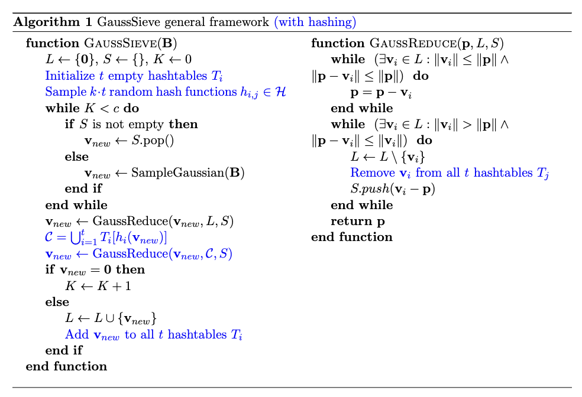

# pqc-attacks

## Introduction

This repository contains Qiskit code to implement the quantum version of the  heuristic GaussSieve algorithm proposed in [1] by Micciancio and Voulgaris 
to solve the [Shortest vector problem (SVP)](https://en.wikipedia.org/wiki/Lattice_problem#Shortest_vector_problem_(SVP)) on lattices. First, we present 
the GaussSieve algorithm and how we can modify it by using hashing techniques.
We then proceed with a brief high-level explanation of our code as well as the bottlenecks 
of our approach. Note that this code serves as a proof of concept and a starting 
point for a more thorough resource estimation of these types of quantum attacks. 
For a more detailed and technical overview of the code please refer to the 
[documentation](add_later)

## GaussSieve (with hashing)

We now present the pseudocode of GaussSieve (taken from [1]) along with a version 
that uses hashing (colored in blue). For more details on how hashing can be used to speed up GaussSieve and which hash families $\mathcal{H}$ provide speedups, refer to [2].
The constants $k$ and $t$ are dependent on the hash family $\mathcal{H}$ while a 
good value for the number of collisions $c$ can be experimentally determined (the original 
paper suggests $c=500$ is good enough).

Notice how ``GaussReduce`` is implementing two searches. In the quantum setting, 
by replacing them with Grover's algorithm we achieve a (theoretical) quadratic 
speedup over the classical version. This is what the code in this repository is 
implementing.

## Encoding vectors

Since vectors can have negative elements, encoding them into a quantum computer 
is not as simple as just encoding their binary representations. To handle the 
signs we store an extra (qu)bit for each vector element representing its sign. This 
is known as the sign-magnitude representation of a signed integer. Therefore, the 
number of bits used for the storage of integers needs to be specified in advance. 
For example, the representation of $-2$ using $5$ bits in sign-magnitude format is 
$\textcolor{red}{1}0010$ whereas $2$ is represented as $\textcolor{red}{0}0010$. All arithmetic operation oracles such as norm calculation, addition, subtraction as well as comparison oracles are implemented with that representation in mind.

**Note:** No overflow test is performed. The user should select an appropriate 
number of bits beforehand, accounting for all operations.

## Quantum RAM

To store the list $L$ in a quantum computer the use of quantum random access memory 
(qRAM) is required. We opted to implement a simple qRAM model with an address and 
a memory register that "loads" each element to its corresponding position. The 
qRAM circuit for a list containing three vectors of dimension 2, where each vector 
elements is encoded in $5$ bits, looks like this:

## Grover search

The main part of this project is the implementation of oracles to perform the 
searches in the ``GaussReduce`` procedure. The code implementing those oracles 
is located in `attacks/grover/oracles.py`. These oracles are meant to be used 
with the built-in [``AmplificationProblem``](https://qiskit.org/documentation/tutorials/algorithms/06_grover.html) class in Qiskit. Following the notation of the linked tutorial, 
``state_preparation`` consists of the qRAM circuit with Hadamard gates on the 
address register, a register encoding $\mathbf{p}$ as well as the necessary ancillas 
(to match the ancillas of the oracle). Finally, ``is_good_state`` is a function 
that (classically) checks if the returned list element has the required property. 

## Bottlenecks

* Due to the large number of qubits needed to perform all the operations the code 
cannot be executed in a simulator, even for small instances of the problem. 
* Due to the limited capabilities of quantum SDKs, implementing a fully capable 
qRAM is extremely difficult. The current architecture cannot handle list updates 
without having to rebuild the qRAM from scratch. This of course eliminates any 
quantum advantage since we already need $\mathcal{O}(|L|)$ time just to prepare 
the Grover circuit. We argue however that an actual (future) quantum computer will 
have these capabilities, much like a classical computer.
* In the same spirit, we assume that stacks and hashtables will be easy to implement 
in a quantum computer without significant extra cost, even though we chose not to 
implement them here.

## Testing the code

Since simulating the full code is beyond the capabilities of the systems we have 
access to (40core CPU, 250GB RAM) we opted to test each oracle separately. Because 
all of them are classical in nature (there is no entanglement), we can simulate 
them easily using Qiskit's [matrix product state](https://qiskit.org/documentation/tutorials/simulators/7_matrix_product_state_method.html) simulation method. The tests we 
wrote can be found in the `tests/` directory and are run automatically every time
new code is pushed to the repository, thus providing assurance on the correctness 
of the code.

## References
[1] Daniele Micciancio and Panagiotis Voulgaris. **Faster exponential 
    time algorithms for the shortest vector problem**. In Proceedings of the 
    twenty-first annual ACM-SIAM symposium on Discrete Algorithms, pages 
    1468–1480. SIAM, 2010

[2] Thijs Laarhoven. **Search problems in cryptography: from fingerprinting to lattice sieving**. 2016.
